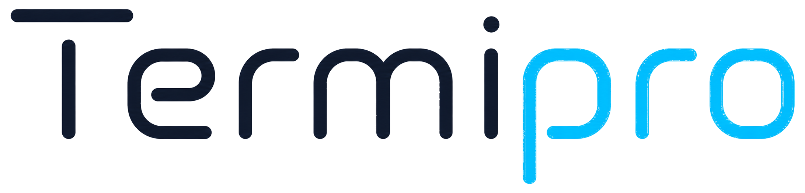

<p align="center">
  
</p>

<h1 align="center">Termipro</h1>

<p align="center">
  A modern Windows terminal for AI coding sessions, project workflows, and fast command recall.
</p>

<p align="center">
  <a href="https://github.com/MrPanda1609/Termipro/releases/latest"></a>
  
  
  
</p>

<p align="center">
  <a href="#download">Download</a>
  · <a href="#features">Features</a>
  · <a href="#why-termipro">Why Termipro</a>
  · <a href="#keyboard-shortcuts">Shortcuts</a>
  · <a href="#development">Development</a>
  · <a href="#releases--auto-update">Releases</a>
</p>

---

## Why Termipro

Termipro is a desktop terminal for Windows that focuses on the way developers use AI coding CLIs every day: switching projects, repeating setup commands, navigating folders, keeping long-running processes alive, and staying updated without manually reinstalling.

It combines an Electron desktop shell, a React UI, `xterm.js`, and `node-pty` to provide a native-feeling terminal with project-aware productivity features.

<table>
  <tr>
    <td><strong>Project-first</strong></td>
    <td>Recent folders, project detection, and remembered commands help you return to work quickly.</td>
  </tr>
  <tr>
    <td><strong>AI CLI friendly</strong></td>
    <td>Optimized around long-running AI coding sessions, clipboard behavior, and multi-tab workflows.</td>
  </tr>
  <tr>
    <td><strong>Desktop polished</strong></td>
    <td>Installer, shortcuts, tray mode, custom dialogs, silent updates, and a clean titlebar.</td>
  </tr>
</table>

## Highlights

<table>
  <tr>
    <td width="50%">
      <h3>Fast project switching</h3>
      <p>Open recent folders from the titlebar, or choose a new workspace when needed.</p>
    </td>
    <td width="50%">
      <h3>Remembered commands</h3>
      <p>Termipro remembers commands per folder and per detected project so repetitive commands are one click away.</p>
    </td>
  </tr>
  <tr>
    <td width="50%">
      <h3>Smart suggestions</h3>
      <p>Autocomplete common commands and folder targets for <code>cd</code>, selectable by mouse, arrows, Tab, or Enter.</p>
    </td>
    <td width="50%">
      <h3>Stay running in tray</h3>
      <p>Hide Termipro to the system tray and keep active terminal processes running in the background.</p>
    </td>
  </tr>
  <tr>
    <td width="50%">
      <h3>Automatic updates</h3>
      <p>Checks GitHub Releases, downloads updates, and installs silently after restart.</p>
    </td>
    <td width="50%">
      <h3>Clean terminal UI</h3>
      <p>Multi-tab layout, polished settings, custom dialogs, themes, opacity, and cursor options.</p>
    </td>
  </tr>
</table>

## Screenshots

Screenshots are optional. If you add them later, place them in `docs/assets/` and embed them here.

```md


```

## Features

### Terminal

- Multi-tab terminal UI.
- PowerShell, Command Prompt, Git Bash, and WSL detection.
- `xterm.js` rendering with resize support through `node-pty`.
- Colorful project prompt showing folder, app name, and version.
- Theme, font, cursor, opacity, and scrollback settings.
- Clipboard-aware paste behavior for AI coding tools.

### Workflow

- Fast working-folder switcher.
- Recent folders dropdown with a `Choose...` fallback.
- Remembered commands per folder and per detected project.
- Quick command menu from the title bar.
- Autocomplete for common commands and `cd` directory targets.
- Click, arrow keys, `Tab`, or `Enter` to accept suggestions.

### Desktop

- Windows installer with Desktop and Start Menu shortcuts.
- Auto-update through GitHub Releases.
- Silent update install after restart.
- Close-to-tray mode that keeps terminal processes running.
- In-app confirmation dialogs instead of default Windows message boxes.
- Dropdowns and Settings panel close automatically on outside click.

## Download

<p>
  <a href="https://github.com/MrPanda1609/Termipro/releases/latest"><strong>Download the latest Windows installer</strong></a>
</p>

Download this file from the latest release:

```text
Termipro-Setup-x.y.z.exe
```

Run the installer, then launch Termipro from the Desktop shortcut or Start Menu.

Termipro checks for updates when it starts. If a new version is available, it downloads the update and asks you to restart. The update installs silently and reopens Termipro automatically.

## Keyboard shortcuts

- `Ctrl + T`: new terminal tab.
- `Ctrl + W`: close current tab when multiple tabs exist.
- `Ctrl + ,`: open Settings.
- `Tab` / `Enter`: accept autocomplete suggestion.
- `ArrowUp` / `ArrowDown`: move through autocomplete suggestions.
- `Esc`: close Settings or autocomplete suggestions.

## AI CLI mouse behavior

Some AI CLI tools implement their own mouse selection or copy behavior. If text selection behaves differently inside a specific CLI, it is usually controlled by that CLI's mouse mode rather than Termipro's terminal renderer.

## Project detection

Termipro detects a project root by walking upward from the current folder and checking for common project markers:

- `.git`
- `package.json`
- `bun.lockb`
- `pnpm-lock.yaml`
- `yarn.lock`
- `requirements.txt`
- `pyproject.toml`
- `Cargo.toml`

Remembered commands are stored separately for:

- the current folder
- the detected project root

## Development

### Requirements

- Windows 10 or Windows 11
- Node.js 18 or newer
- npm
- Visual Studio Build Tools or Visual Studio Community with C++ build tools, required by `node-pty` when native rebuilds are needed

### Install dependencies

```bash
npm install
```

### Run locally

```bash
npm run dev
```

### Build renderer and Electron main process

```bash
npm run build
npm run build:electron
```

### Build Windows installer

```bash
npm run electron:build
```

Generated release files are written to:

```text
release/
```

## Releases & auto-update

Auto-update is powered by `electron-updater` and GitHub Releases.

The release assets must be publicly reachable. If the repository or release assets are private, installed apps cannot read `latest.yml` without authentication.

### Publish a new version

1. Update the version in `package.json`.
2. Build the installer:
   ```bash
   npm run electron:build
   ```
3. Create a GitHub Release using a tag like:
   ```text
   v1.0.9
   ```
4. Upload these files from `release/`:
   ```text
   Termipro-Setup-x.y.z.exe
   Termipro-Setup-x.y.z.exe.blockmap
   latest.yml
   ```
5. Publish the release.

Existing installed copies will detect the new version on startup or when the user clicks `Check for updates` in Settings.

## Useful commands

```bash
npm run dev             # Run Vite + Electron in development
npm run build           # Build the renderer
npm run build:electron  # Build Electron main process
npm run electron:build  # Build Windows installer
```

## Tech stack

- Electron
- React
- Vite
- xterm.js
- node-pty
- electron-builder
- electron-updater

## Data storage

Termipro stores user data under Electron's app user-data directory, including:

- settings
- workspaces
- recent folders
- remembered command history

## License

No license has been declared yet. Add a `LICENSE` file before distributing broadly.
